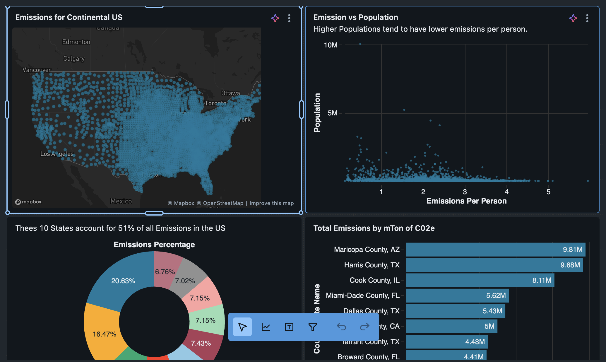

# 🌍 Emissions Dashboard in Databricks

This repository contains my Databricks project for analyzing greenhouse gas emissions across the continental United States. The project focuses on transforming emissions data into analysis-ready datasets with SQL and building an interactive dashboard to explore spatial patterns, per-person emissions, total emissions by state, and county-level emissions concentrations.

---

## 📌 Introduction

This project uses **Databricks SQL** to query and transform emissions data, then visualizes the results in an interactive dashboard.

The dashboard combines location-based analysis, per-capita emissions, state-level totals, and county-level emission rankings to provide a broader view of how emissions are distributed across the United States.

This project demonstrates practical skills in:

- Databricks SQL
- SQL-based data transformation
- calculated metrics
- aggregation and grouping
- dashboard design
- spatial and comparative visualization

---

## 💡 Motivation

Emissions data can be explored from different perspectives. Looking only at total emissions may highlight the largest polluting regions, while emissions per person can reveal areas with unusually high carbon intensity relative to population.

The goal of this project is to use SQL and dashboarding in Databricks to answer questions such as:

- Where are emissions geographically concentrated?
- Which counties have the highest emissions per person?
- Which states contribute the most total emissions?
- How much of total US emissions comes from the top emitting states?

This project shows how SQL can be used not only to query data, but also to prepare targeted datasets for dashboard storytelling.

---

## 📂 Dataset Description

The project uses an emissions dataset stored in Databricks as:

- `emissions.default.emissions_data`

From the screenshots, the dataset includes fields such as:

- `latitude`
- `longitude`
- `county_state_name`
- `state_abbr`
- `population`
- `GHG emissions mtons CO2e`

These fields are used to create multiple custom datasets for the dashboard.

---

## 🧪 SQL Data Preparation

I created several SQL queries in Databricks to generate datasets for different dashboard components.

### 1. Location Data

This dataset extracts:

- latitude
- longitude
- emissions

It is used to map emissions across the continental US.

Example logic:
- select latitude and longitude
- rename greenhouse gas emissions as `Emissions`

### 2. Emissions per Person

This dataset calculates emissions per capita by dividing total emissions by population.

To make the field usable for calculation, I cleaned the emissions column by removing commas and casting it to a numeric type.

Main transformation:
- `REPLACE()` to remove commas
- `CAST(... AS DOUBLE)` to convert text to numeric
- divide by `population`

This dataset helps identify counties with unusually high emissions relative to their population.

### 3. Total Emissions per State

This dataset groups records by state abbreviation and sums total emissions.

Main transformation:
- clean emissions values
- aggregate with `SUM()`
- group by `state_abbr`
- sort in descending order
- limit results to the top states

This supports comparison of state-level emissions totals.

### 4. County Shaming

This dataset ranks counties by total emissions and returns the top contributors.

Main transformation:
- select county name and population
- clean emissions values
- sort by total emissions descending
- limit to the top counties

This dataset supports the bar chart showing the largest county-level emitters.

---

## 🛠️ SQL Techniques Used

This project demonstrates the use of:

- `SELECT`
- `CAST()`
- `REPLACE()`
- aliasing with `AS`
- `SUM()`
- `GROUP BY`
- `ORDER BY`
- `LIMIT`

These techniques were used to create separate datasets tailored to different dashboard visuals.

---

## 📊 Dashboard Components

The final Databricks dashboard includes the following key visualizations:

### 1. Emissions for Continental US
A map-based visualization that plots emissions geographically using latitude and longitude. This helps show the spread and density of emissions across the country.

### 2. Emission vs Population
A scatter plot comparing emissions per person with population. This visual helps explore whether more populated counties necessarily have higher emissions intensity.

### 3. Emissions Percentage
A donut chart showing the contribution of the top 10 states to total US emissions. The dashboard notes that these 10 states account for **51% of all emissions in the US**.

### 4. Total Emissions by mTon of CO2e
A horizontal bar chart ranking top counties by total emissions. This highlights counties such as:

- Maricopa County, AZ
- Harris County, TX
- Cook County, IL
- Miami-Dade County, FL
- Dallas County, TX

as major contributors.

---

## 📈 Key Insights

From the dashboard, several patterns can be observed:

- emissions are broadly distributed across the continental US, with denser concentrations in more populated regions
- higher population does not always correspond to higher emissions per person
- a relatively small group of states contributes a large share of total emissions
- a few counties stand out as major emissions contributors in absolute terms
- combining geographic, per-capita, and total-emissions views provides a more complete understanding of emissions patterns

---

## 🖥️ Final Dashboard

### Emissions Dashboard

This dashboard brings together the main outcomes of the project into one interactive Databricks visualization. It combines map-based analysis, scatter plotting, donut chart comparisons, and ranked bar charts to provide multiple views of emissions patterns across the US.

---

## 📁 Files

- Databricks SQL queries used to generate dashboard datasets
- `Emission_Dashboard.png` – final dashboard screenshot
- source emissions dataset in Databricks

---

## ▶️ How to Reproduce the Project

1. Load the emissions dataset into Databricks
2. Create SQL queries for:
   - location mapping
   - emissions per person
   - total emissions per state
   - county-level emissions ranking
3. Save each query as a dataset
4. Build the dashboard in Databricks using map, scatter, donut, and bar chart visualizations
5. Arrange the visuals into a final dashboard layout

---

## 🎯 Project Goal

The goal of this project is to demonstrate how **Databricks SQL** can be used to transform emissions data into clear, interactive dashboard insights.

This project highlights practical skills in:

- SQL querying in Databricks
- building derived metrics
- state and county aggregation
- spatial analysis
- dashboard storytelling
- environmental data visualization
